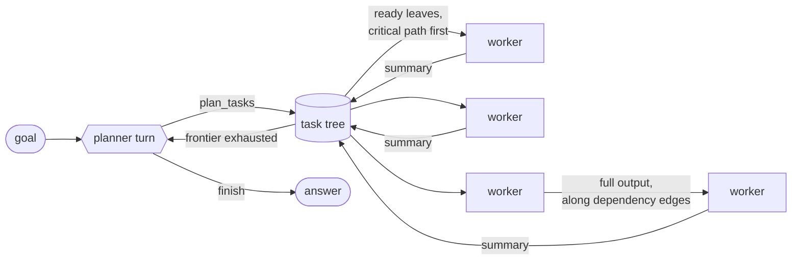

<p align="center">
  
</p>

<p align="center">
  <b>One frontier model plans. A fleet of cheap models executes — in parallel,
  with strict context isolation and a hard budget.</b><br>
  A Python library by <a href="https://www.gwenlake.com">Gwenlake</a>.
</p>

---

Long-running single agents drift: one context window has to hold the whole
goal *and* the current detail, and by the tenth step it holds neither well.
myriapod splits the load in two.

- A **planner** — an expensive model — decomposes the goal into a task tree,
  reads the summaries that come back, repairs what failed, and decides when
  the goal is met. It never writes a deliverable and never sees a raw output.
- **Workers** — cheap, fast models — each execute one leaf task with a
  minimal context: their brief, plus the outputs of the dependencies they
  declared. Nothing else.

Full content moves only along dependency edges; the planner routes on
summaries. That is what lets one frontier model drive hundreds of workers
without its context growing with the fan-out.

The core is framework-free. Adapters bind it to a runtime —
[Pydantic AI](https://ai.pydantic.dev) by default,
[Gwenflow](https://github.com/gwenlake/gwenflow) as an extra — and each one is
under a hundred lines, so a third is not a project.

## Install & run

```bash
uv sync                        # installs myriapod + pydantic-ai
export ANTHROPIC_API_KEY=...   # keys for whichever providers you use

# Ask a question: Opus 5 plans, a Haiku 4.5 fleet executes, $1.5 budget —
# all of that is the default, so this is the whole command line:
uv run myriapod ask "Write a structured market report on X, in French"

# Prove the scheduler scales — offline, no keys, no cost:
uv run myriapod bench -n 1000 -c 500
```

`bench` drives the whole machine on simulated agents, so it is the way to try
the swarm — and the graph — without spending anything:

| Flag | Default | What it does |
| --- | --- | --- |
| `-n` / `--tasks` | `100` | Simulated leaf tasks. |
| `-c` / `--concurrency` | `200` | Workers in flight. |
| `--waves` | `1` | Spread the tasks over N planner turns. Each wave runs only once the previous one is done — on the graph that is one column of workers per wave, left to right. |
| `--groups` | `0` | Add N synthesis tasks, each depending on a slice of the leaves. Dependencies are what the graph colours by group, so raise this to see the colouring. |
| `--planner-delay` | `0` | Seconds each simulated planner turn spends "thinking". Give it a second to watch the root go amber while the workers carry on. |
| `--delay` / `--jitter` | `0.05` | Simulated work per task. |
| `--viz` | off | Live graph. |

```bash
# a run shaped like a real report, slow enough to watch:
uv run myriapod bench -n 40 --waves 3 --groups 4 --planner-delay 2 \
    --delay 1 -c 8 --viz
```

## How it works

A run is a loop over one shared task tree.



**The planner is consulted only when the frontier is exhausted** — at the
start, when everything ready is blocked, and when the tree is drained. Planner
turns are the expensive resource; worker completions refill the pool directly.
The turn itself runs *alongside* dispatch: its `plan_tasks` calls mutate the
tree as it makes them, so workers start on the first briefs while the planner
is still writing the rest.

**A second planner turn is a second wave.** The planner reads the summaries of
what finished and plans follow-ups into the same tree — that is how a run
deepens instead of being decided up front.

**Context isolation is enforced, not advisory.** A worker receives its brief
plus its declared dependencies' outputs, fitted to a character budget by fair
share with spillover — not concatenated. Below a floor a dependency is passed
as its digest rather than as a 1 kB excerpt, because a worker reading forty
introductions is worse informed than one reading forty digests *and believes
itself better informed*. The planner sees `tree.render()` — statuses and short
summaries, settled subtrees collapsed — and nothing else, at any scale.

**Dispatch order is the critical path.** Among ready leaves, the one with the
longest chain of tasks waiting behind it goes first, and a leaf inherits the
queue waiting on its container. A tree with no dependencies at all
short-circuits to id order, so a flat thousand-task fan-out pays nothing for
an ordering that could not change anything.

**Failures are absorbed below the planner.** Transient errors are retried
inside the worker with exponential backoff and jitter — rate-limit friendly —
under a per-worker timeout. Only persistent failures reach a planner turn,
where it can `retry_task`, `skip_task`, or plan around them. Failed attempts
are billed too, so a run that is failing expensively says so.

**A truncated answer is caught.** A worker ends its answer with
`<summary>…</summary>`; a missing closing tag means it hit the model's output
ceiling, so the task is marked and the planner can re-plan it smaller — rather
than a report that stops mid-sentence reaching the deliverable looking
finished.

**Two worker tiers, if you want them.** The planner declares an effort per
brief (`low` / `standard` / `high`) and `--strong-worker` routes the high ones
to a better model. Each tier is billed at its own rate.

**A quality gate, if you want one.** `--reviewer` is the only reader in the
system holding both a brief and the answer to it — the planner sees summaries
by design, which is what makes a twelve-idea brief answered with six ideas
invisible. It can send an answer back for one rewrite, and it fails open: an
unparseable verdict, a reviewer error or a failed rewrite all keep the
original answer.

**Guardrails everywhere.** `max_cost` (a hard dollar ceiling, enforced as the
run goes), `max_tasks`, `max_planner_turns`, `max_depth`, stall detection, and
a best-effort fallback answer if the run stops without `finish`.

**Runs are resumable.** The tree carries every settled task's output; passing
it back as `resume=` keeps that work and sends whatever was in flight back to
pending. A run stopped by its budget is finished for a few cents instead of
being redone — provided you persisted the tree, which is the only place full
outputs live.

## Watching a run

With `--viz` you get the [live graph](#live-visualization). Without it, every
entry point paints a status line on stderr, because a terminal that prints
nothing for the two minutes a planner spends writing a fifty-task plan is
indistinguishable from one that has hung:

```
⠸ Swarming…   working      24 tasks  ▶   8  ✔    6  ·   10  ✖  0    41.2s  $0.0231
```

Spinner, phase (`planning` / `working` / `scheduling`), task counts by status,
elapsed time and cost so far. From your own code:

```python
from myriapod.progress import run_with_progress, arun_with_progress

result = run_with_progress(swarm, "...")          # sync
result = await arun_with_progress(swarm, "...")   # async
```

It is skipped automatically when stderr is not a terminal (a pipe, a log
file), and with `quiet=True` or the CLI's `-q`.

## The CLI flags that matter

Out of the box the planner is `anthropic:claude-opus-5`, the workers are
`anthropic:claude-haiku-4-5`, both are billed at their public list price, and
the run stops at `$1.5`.

| Flag | Default | What it does |
| --- | --- | --- |
| `-p` / `--planner` | `anthropic:claude-opus-5` | The model that plans, monitors and decides when the goal is met. It only ever sees task statuses and summaries, so it stays cheap even on a big run — use a frontier model here. Env: `MYRIAPOD_PLANNER`. |
| `-w` / `--worker` | `anthropic:claude-haiku-4-5` | The model every leaf task runs on. This is where the tokens go: one call per task, all in parallel. Env: `MYRIAPOD_WORKER`. |
| `-c` / `--concurrency` | `8` | How many workers run **at the same time**, not how many tasks the run has (the planner decides that). Raising it shortens wall time — 40 tasks at `-c 8` is five waves, at `-c 40` it is one — but every worker in flight is a simultaneous API call, so the real ceiling is your provider's rate limits (TPM/RPM), not the scheduler. Start at 8, push to 32–64 on a paid tier; rate-limit failures are retried with backoff rather than killing the run. |
| `-f` / `--fanout` | off | Ask the planner for roughly N parallel tasks — one worker each — when you want a wide run (`-f 100`) instead of the fan-out it would pick on its own. It stays a *request*: a goal that cannot support 100 distinct briefs gets fewer tasks, not 100 overlapping ones. Past 20 tasks it raises `--max-tokens` for you, so a big plan is not truncated mid-brief. |
| `--strong-worker` | off | A second tier for the tasks the planner marks as high effort — synthesis, prioritisation, arbitration between contradictory findings. Everything else stays on `--worker`. Each tier is billed at its own list price. |
| `--reviewer` | off | The quality gate described above. Roughly doubles the calls per task, so point it at a cheap model. |
| `--max-cost` | `1.5` | Hard $ budget. The run stops as soon as the accumulated cost crosses it and returns what it already has. `--max-cost 0` removes the ceiling. |
| `--max-tokens` | `8192` | Output ceiling per planner turn and per worker answer. Raise it (`16000`) for long, dense sections. |
| `--max-turns` | `12` | How many times the planner may be consulted. It is only woken when the frontier is exhausted, so this bounds re-planning, not tasks. |
| `--max-tasks` / `--depth` | `2000` / `3` | Size and depth of the task tree — guardrails against a planner that keeps subdividing. |
| `--timeout` | `300` | Per-worker timeout in seconds. A worker that blows it is retried, then reported to the planner. |
| `--web` | off | Gives workers DuckDuckGo search (needs the `[web]` extra). |
| `-o` / `--output` | — | Write the answer to a file; repeatable. See below. |
| `--viz` | off | Live task graph in the browser. The run exits when it is done; `--viz-hold` keeps the server up instead. |
| `--resume` | — | Continue a run from a `--save-tree` file: finished tasks keep their output and are not paid for twice, whatever was in flight goes back to pending. |
| `--json`, `--save-tree`, `-q`, `-v` | — | Full result as JSON, task tree dumped to a file, no live status line, scheduler logs. |

Model strings are Pydantic AI's `provider:model` form (`openai:…`,
`anthropic:…`, `google-gla:…`, `ollama:…`).

## Deliverables (`-o`)

`-o/--output` writes the answer to a file; the extension picks the format.

```bash
uv run myriapod ask "..." -o report.md      # verbatim + provenance footer
uv run myriapod ask "..." -o report.pdf     # paginated A4 document
uv run myriapod ask "..." -o deck.pptx      # 16:9 deck, one slide per heading
```

`-o` is repeatable, so one run can produce several renderings:

```bash
uv run myriapod ask "a precise, scientific brief on the Antikythera mechanism" \
    --max-tokens 16000 --max-cost 2.0 \
    --viz -o antikythera.pdf -o antikythera.pptx
```

That run plans nine tasks (eight parallel sections plus a synthesis that
depends on them all), takes a few minutes, and costs well under a dollar.

Workers answer in Markdown, so the answer already has headings, bullets,
tables and emphasis. `myriapod.report` parses that **once** into a block model
and renders it per format, so a PDF looks like a document and a deck looks
like a deck. Every file carries a footer (or cover slide) with the models
used, the run outcome and the cost. `.md`/`.txt` need nothing extra;
`.pdf`/`.pptx` need the `docs` extra:

```bash
uv add 'myriapod[docs]'      # fpdf2 + python-pptx
```

From Python: `save_report(path, result.content, title=..., meta=[...])`.

## Cost

Known models are billed automatically at their public list price (the Claude
line-up, `$/M` input/output, from
[Anthropic's pricing page](https://platform.claude.com/docs/en/about-claude/pricing)),
so `--max-cost` is enforceable with no extra flags. For any other model — or a
negotiated rate — pass `--planner-price` / `--worker-price` as `INPUT/OUTPUT`
in dollars per million tokens (`--worker-price 1/5`); they also override the
built-in table. With no price at all the run still works, but it reports token
counts instead of dollars and `--max-cost` cannot bite.

Token usage itself comes from the provider: at the time of writing, Pydantic
AI reports zero tokens for OpenAI models, so cost tracking — and therefore
`--max-cost` — is only reliable where usage is reported. Anthropic reports it.

## Python API

```python
from myriapod.adapters.pydantic_ai import build_swarm

swarm = build_swarm(
    planner_model="anthropic:claude-opus-5",
    worker_model="anthropic:claude-haiku-4-5",
    max_concurrency=64,
    max_cost=2.0,
    planner_pricing={"input": 5.0, "output": 25.0},    # $/M tokens
    worker_pricing={"input": 1.0, "output": 5.0},
)
result = swarm.run("...")          # or: await swarm.arun("...")
result.content                     # final answer
result.costs.to_dict()             # planner vs workers: tokens, $, share
result.tree                        # full task tree (JSON-ready post-mortem)
```

A two-tier fleet with a quality gate, and a run that survives a crash:

```python
swarm = build_swarm(
    planner_model="anthropic:claude-opus-5",
    worker_model={                                  # routed on the effort
        "standard": "anthropic:claude-haiku-4-5",   # the planner declared
        "high": "anthropic:claude-sonnet-5",        # per task
    },
    reviewer_model="anthropic:claude-haiku-4-5",    # judges each answer
    max_revisions=1,                                # one rewrite at most
    worker_pricing={                                # one rate per tier
        "standard": {"input": 1.0, "output": 5.0},
        "high": {"input": 3.0, "output": 15.0},
    },
)
result = swarm.run("...")
if not result.finished:                             # crash, budget, timeout
    result = swarm.run("...", resume=result.tree)   # finished work is kept
```

Give the fleet tools with `worker_tools=[...]` — plain callables, shared by
every worker (see [`examples/06_market_brief.py`](examples/06_market_brief.py)).
The planner gets none: it plans on summaries and gathers nothing itself.

The two prompts are the main behavioural lever, far more than any scheduler
knob: `build_swarm(planner_system_prompt=..., worker_system_prompt=...)`
overrides them per swarm.

The Python API takes pricing explicitly — the CLI's list-price table lives in
`myriapod.cli.MODEL_PRICING` if you want the same numbers.

Any agent runtime works: implement `AgentLike` (an async
`run(message, context) -> RunOutcome`) and hand two factories to
`myriapod.core.Swarm`. See `src/myriapod/adapters/`.

## Built for 100–1000 agents

- Settled state is tracked with incremental per-parent counters, so
  completion checks are O(1) and `ready_tasks()` is a linear scan — a
  2000-task tree drains in well under a second of scheduler overhead.
- `tree.render()` collapses settled subtrees and caps its size, so the
  planner's context stays bounded at any scale.
- One shared, stateless worker agent for the whole fleet: no per-task
  construction cost.
- The practical ceiling is your **provider rate limits**, not the scheduler:
  size `-c` to your TPM/RPM, set `--max-cost`, and let backoff do its job.
  `myriapod bench` measures the scheduler alone.

## Live visualization

Watch the swarm think — agents appearing and working as a live graph in your
browser, with zero extra dependencies:

```bash
uv run myriapod ask "..." --viz               # opens http://127.0.0.1:8400
uv run myriapod bench -n 1000 -c 500 --viz    # 1000 agents, offline, free
```

Every task is a node. Up to ~60 tasks they are **HUD panels** carrying a
telemetry line and the brief itself — `✔ T-07 · HAIKU-4.5 · 2.6K` then the
first line of the task description — so you can read who is doing what, and
how much it cost, without clicking. Past that they collapse to dots sized by
token count, and past ~70 tasks labels hide entirely.

Two channels, and they never fight: **the border is the status** — saturated
colour, plus a glyph (`·` pending, `◈` running, `✔` done, `✖` failed, `⊘`
skipped) and a halo on anything live — while **the fill is the dependency
group**. Tasks wired together share a fill colour, and the arrow between them
takes it too, so one glance tells you which agents are preparing material for
which. Group colours are cool hues only, precisely so they can never be
mistaken for a status.

**The run reads left to right.** The goal, then the workers the first planner
turn created, then the next wave in the column beside them. Only agents are
drawn: a planner turn is the *gap* between two columns, not a box of its own.
A re-plan is therefore visible as what it is — a new column appearing on the
right while the root goes amber (`thinking…`) — and the planner's own tokens
and cost sit on the root node. Dashed arrows cut across the waves wherever a
later task consumes an earlier one's output.

Click a node to fade the rest and open a panel with its worker, attempts,
tokens, cost, duration, summary and the subtasks it planned. Three layouts
cycle with the button (**tree**, **radial**, **organic**), `fit` reframes, and
`png` exports the whole graph at high resolution.

From Python:

```python
from myriapod.viz import serve

with serve(swarm):                 # yields the URL, opens the browser
    result = swarm.run("...")
```

Under the hood: a stdlib-only threaded HTTP server streams the tree over
Server-Sent Events — full snapshot on connect, then only changed nodes,
throttled. Raw worker outputs never leave the process: the wire carries
truncated descriptions and summaries only, the same isolation rule the planner
lives by. Cytoscape.js and dagre are fetched from a CDN by *your browser*; the
myriapod process makes no outbound request, and a blocked CDN degrades the
layout rather than breaking the page.

## Examples

```bash
uv run python examples/01_offline_swarm.py        # the whole machine, no model, free
uv run python examples/02_live_graph.py           # 60 agents in the browser, free
uv run python examples/03_ask.py                  # a small real run
uv run python examples/04_report_and_resume.py    # deliverables, and resuming
uv run python examples/05_news_digest.py "European AI regulation"
uv run python examples/06_market_brief.py NVDA MSFT ASML
```

The first two run on simulated agents — no API key, no cost — and are the
fastest way to understand the loop. The last two are the interesting shapes: a
fan-out of searching workers reconciled by an editor, and a fleet sharing one
tool of your own. See [`examples/`](examples/).

## Layout

```
src/myriapod/
├── core/            # framework-free: task_tree, scheduler, planner, worker, reviewer, protocol
├── adapters/        # pydantic_ai (default runtime), gwenflow (extra)
├── viz/             # optional live graph: SSE server + embedded page
├── report.py        # Markdown -> md / txt / pdf / pptx
├── progress.py      # the terminal status line
├── testing.py       # scripted planner + simulated workers (tests & bench)
└── cli.py           # ask / bench / version
```

## Tests

```bash
uv run python -m pytest   # 109 tests: tree, scheduler, CLI, reports — all offline
```
